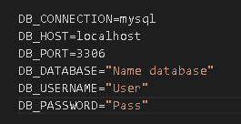

## prueba apis laravel

## Crear archivo .env en la raiz del proyecto

## Para conectar con la base de datos Copiar todo el codigo del archivo 
## .env.example al archivo .env y editar las siguientes lineas

## Instalar paquetes[generar carpeta vendor]
- composer install

## Correr el proyecto
- php artisan serve

## Generar modelos de la Base de datos
- php artisan krlove:generate:model  Producto --table-name=producto --namespace=App\Models --output-path=Models

## Generar controlador en base al modelo
- php artisan make:controller ProductoController --api --model=Producto

## Generar recurso en base al controlador
- php artisan make:resource ProductoResource
  
## Crear un observador de eventos de un modelo cuando se [actualiza,guarda etc]
- php artisan make:observer ProductoObserver --model=Producto

## Generar patron de repositorio
- solo se ejecuta una vez para inyectar las clases necesarias

- php artisan make:provider RepositoryServiceProvider

- composer dump-autoload
